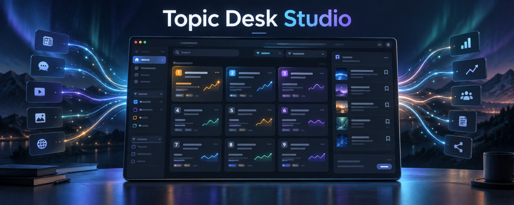

# Topic Desk Studio

<p align="center">
  
</p>

<p align="center">
  A private, local-first desktop workspace for discovering, tracking, and curating trending topics.
</p>

<p align="center">
  <a href="./README.md">English</a> · <a href="./README.zh-CN.md">简体中文</a>
</p>

<p align="center">
  <a href="https://github.com/microai-lab/topic-desk-studio/actions/workflows/release.yml"></a>
  
  
  <a href="./LICENSE"></a>
</p>

Topic Desk Studio is a standalone desktop edition of [`dsh-topic-desk`](https://github.com/microai-lab/dsh-topic-desk). It collects public trending topics into a local SQLite database without requiring DeepSeek Harness, a Node.js sidecar, an account, or a remote database.

## Highlights

- **49 built-in sources** across Chinese and international platforms.
- **Resilient collection:** one failing source never blocks the others.
- **Automatic refresh** at startup and every 10 minutes, plus manual refresh.
- **Fast local discovery** with source, region, category, keyword, and sort filters.
- **Trend context** including rank movement, sparklines, first-seen time, and consecutive appearances.
- **Persistent creation queue** that keeps saved topics even after they leave the live charts.
- **Source controls and health** with individual enable/disable switches and recent error details.
- **Optional title translation** through any OpenAI-compatible chat-completions endpoint.
- **Private by design:** topics and queues stay on the device, while API keys live in the operating system credential vault.
- **Safe link handling:** the top-right browser button directly shows or hides the isolated browser side panel, where original articles open as tabs. Only HTTP(S) navigation is allowed; remote pages receive no main-webview capabilities.

## Screens and workflows

| Discover | Curate | Operate |
| --- | --- | --- |
| Browse current topics and newly collected items. | Save promising topics to a durable creation queue. | Enable sources, inspect health, and configure optional translation. |
| Filter by source, region, category, or keyword. | Keep items even after they disappear from the rankings. | Review per-source failures without interrupting healthy collectors. |

## Architecture

| Layer | Technology | Responsibility |
| --- | --- | --- |
| Desktop shell | Tauri 2 | Native windowing, commands, events, permissions, and packaging |
| Interface | React 19, TypeScript, Vite | Search, filters, topic views, queue, and settings |
| Core | Rust | HTTP collection, parsing, validation, normalization, deduplication, and scheduling |
| Storage | Bundled SQLite via `rusqlite` | Topics, observations, collection runs, queue, and non-secret settings |
| Secrets | OS credential vault | macOS Keychain, Windows Credential Manager, or Linux Secret Service |

The React interface can access local capabilities only through typed Tauri commands and events. Networking, SQLite access, scheduling, proxy behavior, and credential access remain in the Rust backend. Content returned by external sources is treated as untrusted input and is normalized before storage or display.

## Supported desktop platforms

| Platform | Target | Packaging |
| --- | --- | --- |
| macOS | Apple Silicon and Intel | Native Tauri bundle; public distribution requires signing and notarization |
| Windows | x64 | Native Tauri installer; public distribution should be code-signed |
| Linux | x64 | Native Tauri bundles built on Ubuntu 22.04 |

The GitHub Actions workflow builds each package on its native operating system. Release builds use size optimization, LTO, symbol stripping, and `panic = "abort"` to keep installers compact.

### macOS: "Topic Desk Studio.app is damaged" on first launch

The published macOS builds are not yet signed or notarized, so Gatekeeper blocks downloaded copies with a misleading "damaged" message. The app is intact; clear the quarantine attribute once after installing:

```bash
xattr -d com.apple.quarantine "/Applications/Topic Desk Studio.app"
```

## Getting started

### Prerequisites

- Node.js 20 or newer
- pnpm 11.19 or newer
- Current stable Rust toolchain
- [Tauri system dependencies](https://v2.tauri.app/start/prerequisites/) for your operating system

### Run in development

```bash
pnpm install
pnpm dev:desktop
```

### Build a native installer

```bash
pnpm build:desktop
```

Installers are written under `src-tauri/target/release/bundle/`. Build each target on its matching operating system; Tauri does not support every installer format through cross-compilation.

## Verification

```bash
pnpm typecheck
pnpm test
cargo fmt --manifest-path src-tauri/Cargo.toml -- --check
cargo test --manifest-path src-tauri/Cargo.toml
cargo clippy --manifest-path src-tauri/Cargo.toml --all-targets -- -D warnings
```

Before publishing a release, smoke-test the real installer on every target operating system.

## Translation and credential security

Translation is optional and disabled until configured. The endpoint and model name are non-sensitive settings stored in SQLite. The API key is stored through the operating system credential vault:

- **macOS:** Keychain
- **Windows:** Credential Manager
- **Linux:** Secret Service, commonly backed by GNOME Keyring or KDE Wallet

The full key is never returned to the WebView. When translation is requested, the Rust backend reloads the selected title from SQLite, reads the key from the credential vault, and calls the configured endpoint directly.

The default compatible endpoint is `https://api.deepseek.com` with model `deepseek-chat`, but it can be replaced with another OpenAI-compatible service. A trusted local endpoint may be used without an API key.

## Data and privacy

- The local database is named `topic-desk.sqlite` and lives in the application data directory assigned by the operating system.
- Topic history, collection runs, source health, and the creation queue are stored locally.
- Topic Desk Studio does not require an account and does not upload the creation queue.
- Only a title explicitly selected for translation is sent to the configured model endpoint.
- Availability of public sources may change as websites update their feeds, markup, or access policies.

Do not commit API keys, credentials, runtime databases, logs, build output, or signing material.

## Release automation

Push a tag matching `v*` or run the `build-desktop` workflow manually. GitHub Actions builds artifacts for:

- macOS Apple Silicon
- macOS Intel
- Windows
- Linux

For a `v*` tag, the workflow waits for every native build, creates or updates the matching GitHub Release, generates release notes, and attaches the native installers. A manual workflow run keeps its packages as Actions artifacts without creating a Release.

Signing credentials are intentionally not included in the repository and must be configured separately for public distribution.

## License

[MIT](./LICENSE) © 2026 MicroAI Lab
